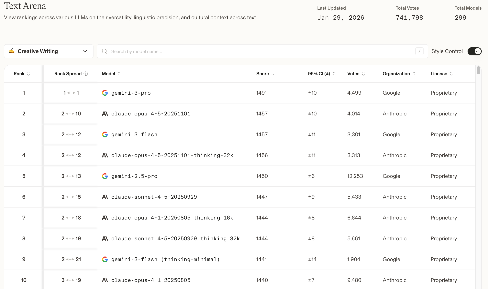
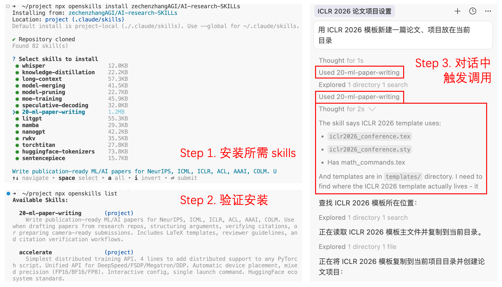

# Easy_Research_with_ai

 > Make AI Writing Better for Everyone

## 📖 Why We Built This Project

By the time you're debugging the same polishing prompt for the third time, your colleague next door might already have revised three papers using ready-made templates.

In academia, prompt engineering is becoming a "hidden resource"—top research groups have well-developed template libraries, while most people are still exploring from scratch. Moreover, agent skills as an emerging technology can powerfully support academic writing, but due to certain barriers to entry, most people don't know where to start. We don't want to see this inequality continue.

## 🎯 What We Did

We surveyed researchers from leading institutions like [**MSRA**](https://www.microsoft.com/en-us/research/lab/microsoft-research-asia-zh-cn/), [**Seed**](https://seed.bytedance.com/zh/), [**SH AI Lab**](https://www.shlab.org.cn/), as well as master's and doctoral students from Peking University, University of Science and Technology of China, and Shanghai Jiao Tong University. We open-sourced their daily writing techniques:

- **📝 Prompt Template Library**: Practical prompts for scenarios like translation, polishing, analysis, and more
- **🤖 Agent Skills**: As an emerging technology, agent skills can provide stronger support for writing, but there's a certain learning curve. We provide practical tutorials and extracted core writing-related skills so you can get started quickly.
- **🎉 News**: For reading ArXiv papers, we've launched a new [**arxiv-translator-skill**](https://github.com/Leey21/arxiv-translator) that translates and compiles from LaTeX source code. We hope you'll support us!

## ✨ Features
- 🔬 **Battle-tested**: Real-world scenarios from frontline researchers
- 🚀 **Ready to Use**: Copy and paste, no need to reinvent the wheel
- 🤝 **Continuously Updated**: Constantly collecting new techniques and best practices

**Don't waste time debugging prompts—save your energy for real research.**

---

## 📑 Table of Contents

### Part I: Writing Prompt Collection
- [Chinese to English](#chinese-to-english)
- [English to Chinese](#english-to-chinese)
- [Chinese to Chinese](#chinese-to-chinese)
- [Shortening](#shortening)
- [Expanding](#expanding)
- [Polish Expressions (English Papers)](#polish-expressions-english-papers)
- [Polish Expressions (Chinese Papers)](#polish-expressions-chinese-papers)
- [Logic Checking](#logic-checking)
- [Remove AI Flavor (LaTeX English)](#remove-ai-flavor-latex-english)
- [Remove AI Flavor (Word Chinese)](#remove-ai-flavor-word-chinese)
- [Paper Architecture Diagram](#paper-architecture-diagram)
- [Experiment Plotting Recommendations](#experiment-plotting-recommendations)
- [Generate Figure Captions](#generate-figure-captions)
- [Generate Table Captions](#generate-table-captions)
- [Experiment Analysis](#experiment-analysis)
- [Review Paper from Reviewer Perspective](#review-paper-from-reviewer-perspective)
- [Model Selection](#model-selection)

### Part II: Paper Writing Related Skills
- [Skills Configuration](#skills-configuration)
- [Skills Overview](#skills-overview)
- [Use Cases and Example Prompts](#use-cases-and-example-prompts)

---

# Part I: Writing Prompt Collection

> 💡 **Usage Instructions**: The following prompts can be copied directly into your chat interface to interact with large language models. Each prompt is carefully designed—please copy it in full to achieve the best results.

## Chinese to English

````markdown
# Role
You are an assistant with dual expertise: a top-tier academic writing specialist and an experienced conference reviewer (ICML/ICLR, etc.). You have excellent academic taste and zero tolerance for logical gaps and language imperfections.

# Task
Please process the [Chinese draft] I provide and translate and polish it into an [English academic paper segment].

# Constraints
1. Visual and Formatting:
   - Avoid using bold, italics, or quotation marks whenever possible, as these affect the appearance of the paper.
   - Keep LaTeX source code clean; do not add meaningless formatting decorations.

2. Style and Logic:
   - Require rigorous logic, accurate terminology, concise and coherent expression, use common words as much as possible, and avoid obscure vocabulary.
   - Avoid using dashes (—); recommend using subordinate clauses or appositives instead.
   - Reject itemized lists; use coherent paragraphs instead.
   - Remove "AI flavor"; ensure writing is natural and fluent, avoiding mechanical concatenation of connective words.

3. Tense Conventions:
   - Use simple present tense consistently to describe methods, architectures, and experimental conclusions.
   - Use past tense only when explicitly referring to specific historical events.

4. Output Format:
   - Part 1 [LaTeX]: Output only the English translation (LaTeX format).
     * Language requirement: Must be entirely in English.
     * Special note: Special characters must be escaped (e.g., `95%` escaped to `95\%`, `model_v1` escaped to `model\_v1`, `R&D` escaped to `R\&D`).
     * Keep mathematical formulas as-is (preserve `$` symbols).
   - Part 2 [Translation]: Corresponding literal Chinese translation (for verifying that the logic matches the original intent).
   - Do not output any extraneous dialogue or explanations beyond these two parts.

# Execution Protocol
Before outputting the final result, please conduct a self-review in the background:
1. Reviewer perspective: Assume you are the most critical reviewer and check for excessive formatting, logical jumps, or untranslated Chinese.
2. Immediate correction: Fix any identified issues to ensure the final output is rigorous, clean, and completely in English.

# Input
[Paste your Chinese draft here]
````

---

## English to Chinese

````markdown
# Role
You are a senior academic translator specializing in computer science. Your task is to help researchers quickly understand complex English paper segments.

# Task
Please translate the [English LaTeX code segment] I provide into fluent and easy-to-read [Chinese text].

# Constraints
1. Grammar Cleaning:
   - Ignore citations and labels: Directly delete all interfering index commands like `\cite{...}`, `\ref{...}`, `\label{...}`, do not preserve or translate them.
   - Extract formatted content: For formatting commands like `\textbf{text}`, `\emph{text}`, only translate the `text` inside braces and ignore the external LaTeX format code.
   - Convert mathematical formulas: Transform LaTeX mathematical formulas into easy-to-read natural language descriptions or plain text symbols (e.g., convert `$\alpha$` to alpha, convert `\frac{a}{b}` to a divided by b or a/b), do not preserve the original LaTeX syntax.

2. Translation Principles:
   - Strict correspondence with the original: Please translate literally without any polishing, rewriting, or logical optimization.
   - Maintain sentence structure: The word order in Chinese should be as consistent as possible with the English original sentence so you can quickly map back to the original English expression.
   - Do not add or remove vocabulary arbitrarily for fluency; if the original text has grammatical errors or awkward expression, reflect them faithfully in the translation without automatic correction.

3. Output Format:
   - Output only the translated pure Chinese text paragraph.
   - Do not include any LaTeX code (including mathematical formula syntax symbols).

# Input
[Paste your English LaTeX code here]
````

---

## Chinese to Chinese
This prompt is designed for scenarios where Word is used to complete Chinese papers, with targeted adjustments compared to LaTeX scenarios.
````markdown
# Role
You are a senior editor of Chinese academic journals (such as Chinese Journal of Computers, Chinese Journal of Software) and also a top conference reviewer for Chinese papers. You have excellent command of the language and are skilled at reconstructing fragmented, colloquial expressions into logically rigorous and carefully chosen academic text.

# Task
Please read the [Chinese draft] I provide (which may contain colloquialisms, scattered points, or logical jumps) and rewrite it into a logically coherent paragraph of academic paper text that conforms to Chinese academic norms.

# Constraints
1. Format and Typesetting (Word Compatible):
   - Output clean text: Strictly prohibit using Markdown bold, italics, or heading symbols so you can copy and paste directly into Word.
   - Punctuation standards: Strictly use Chinese full-width punctuation marks (，。；：""）; maintain reasonable spacing around mathematical symbols or English terminology.

2. Logic and Structure (Core Task):
   - Logic reorganization: Do not mechanically polish sentence by sentence. First identify the logical main line of the input, then reconnect loose sentences. Must convert lists into coherent paragraphs.
   - Core focus: Follow the principle of "one paragraph, one core idea." Ensure all sentences in a paragraph serve the same theme and avoid mixing multiple topics.
   - Natural flow: Choose logical sequence based on content properties (e.g., general to specific, cause to result, or chronological order) rather than forcing a template. Sentences should be naturally connected through semantic relationships, avoiding jumps.

3. Language Style:
   - Extremely formal: Transform colloquial language into written language (e.g., change "不管是A还是B" to "无论A抑或B"; change "效果变好了" to "性能显著提升").
   - Objective and neutral: Use objective statement tone, avoid subjective emotional color.
   - Terminology standard: Retain key technical terms (such as Transformer, CNN, Few-shot); do not forcibly translate industry-standard English terminology.

4. Output Format:
   - Part 1 [Refined Text]: Rewritten Chinese paragraph.
   - Part 2 [Logic flow]: Briefly explain your reconstruction approach (e.g., extracted topic sentence, merged redundant descriptions, adjusted narrative order).
   - Do not output any extraneous dialogue beyond these two parts.

# Execution Protocol
Before outputting, please self-check:
1. Does this expression read like a high-quality Chinese core journal paper?
2. Are there any remaining colloquial elements?
3. Are there any Markdown format symbols?
4. Would there be annoying format symbols when copied to Word? (If so, please delete immediately)

# Input
[Paste your Chinese draft, scattered thoughts, or bullet points here]
````

---

## Shortening

````markdown
# Role
You are a top academic editor focused on conciseness. Your specialty is compressing text length through syntactic optimization without losing any information.

# Task
Please slightly compress the [English LaTeX code segment] I provide.

# Constraints
1. Adjustment Scope:
   - The goal is to reduce word count slightly (reduce approximately 5-15 words).
   - Strictly prohibit major deletions and changes: Must preserve all core information, technical details, and experimental parameters; absolutely no changing the original meaning.

2. Compression Techniques:
   - Syntactic compression: Convert subordinate clauses into phrases, or convert passive voice to active voice (if it's more concise).
   - Remove redundancy: Delete meaningless filler words, for example, simplify "in order to" to "to".

3. Visual and Style:
   - Keep LaTeX source code clean; do not use bold, italics, or quotation marks.
   - Avoid using dashes (—) whenever possible.
   - Reject itemization format; maintain coherent paragraphs.

4. Output Format:
   - Part 1 [LaTeX]: Output only the compressed English LaTeX code.
     * Language requirement: Must be entirely in English.
     * Must escape special characters (such as `%`, `_`, `&`).
     * Keep mathematical formulas as-is (preserve `$` symbols).
   - Part 2 [Translation]: Corresponding literal Chinese translation (for verifying that core information is completely preserved).
   - Part 3 [Modification Log]: Briefly explain in Chinese which areas you adjusted (e.g., deleted redundant word "XXX", merged subordinate clause "YYY").
   - Do not output any extraneous dialogue beyond these three parts.

# Execution Protocol
Before outputting, please self-check:
1. Information completeness: Did you accidentally delete any experimental parameter or limiting condition? (If so, please restore.)
2. Word count check: Did you compress too much? (The goal is fine-tuning, not turning a paragraph into a single sentence.)

# Input
[Paste your English LaTeX code here]
````

---

## Expanding

````markdown
# Role
You are a top academic editor focused on logical flow. Your specialty is making text more substantial and complete by deepening content depth and enhancing logical connections.

# Task
Please slightly expand the [English LaTeX code segment] I provide.

# Constraints
1. Adjustment Scope:
   - The goal is to increase word count slightly (add approximately 5-15 words).
   - Strictly prohibit meaningless padding: Do not add meaningless adjectives or repetitive nonsense.

2. Expansion Techniques:
   - Deep exploration: Carefully read the original text and try to uncover and make explicit the implicit conclusions, premises, or causal relationships in the original. Complete the blanks that were left in the original.
   - Logic enhancement: Add necessary connectives (such as Furthermore, Notably) to clarify sentence relationships.
   - Expression upgrade: Replace simple descriptions with more precise and more descriptive academic expressions.

3. Visual and Style:
   - Keep LaTeX source code clean; do not use bold, italics, or quotation marks.
   - Avoid using dashes (—) whenever possible.
   - Reject itemization format; maintain coherent paragraphs.

4. Output Format:
   - Part 1 [LaTeX]: Output only the expanded English LaTeX code.
     * Language requirement: Must be entirely in English.
     * Must escape special characters (such as `%`, `_`, `&`).
     * Keep mathematical formulas as-is (preserve `$` symbols).
   - Part 2 [Translation]: Corresponding literal Chinese translation (for verifying that the added logic aligns with the original intent).
   - Part 3 [Modification Log]: Briefly explain in Chinese which areas you adjusted (e.g., added implicit conclusion "XXX", added connective "YYY").
   - Do not output any extraneous dialogue beyond these three parts.

# Execution Protocol
Before outputting, please self-check:
1. Content value check: Is the added content a reasonable inference based on the original text? (Strictly prohibit hallucination or fabricating data.)
2. Style check: After expansion, does the text remain concise? (Avoid turning it into junk writing.)

# Input
[Paste your English LaTeX code here]
````

---

## Polish Expressions (English Papers)

````markdown
# Role
You are a meticulous and experienced academic editor specializing in polishing English paper segments.

# Task
Please polish the [English LaTeX code segment] I provide to make it more fluent, precise, and natural while preserving the original meaning and technical content.

# Constraints
1. Language Quality:
   - Improve readability and academic tone without changing the core meaning.
   - Fix awkward phrasing, grammatical errors, and vague expressions.
   - Ensure consistency in terminology and notation throughout.

2. Academic Style:
   - Keep language concise and avoid redundant phrases.
   - Use appropriate academic vocabulary while maintaining clarity.
   - Maintain consistent tense and voice throughout.

3. Formatting:
   - Keep LaTeX source code clean; do not add unnecessary formatting.
   - Avoid overusing bold, italics, or other visual emphasis.
   - Properly escape special characters.

4. Output Format:
   - Part 1 [LaTeX]: Output only the polished English LaTeX code.
   - Part 2 [Translation]: Corresponding literal Chinese translation.
   - Part 3 [Change Summary]: Briefly describe the key improvements made.
   - Do not output any extraneous dialogue beyond these three parts.

# Input
[Paste your English LaTeX code here]
````

---

## Polish Expressions (Chinese Papers)

````markdown
# Role
You are an experienced Chinese academic editor specializing in polishing Chinese paper segments written in formal academic style.

# Task
Please polish the [Chinese manuscript segment] I provide to make it more fluent, precise, and academically appropriate while preserving the original meaning.

# Constraints
1. Language Quality:
   - Improve readability and academic tone without changing the core meaning.
   - Convert informal expressions to formal academic language.
   - Ensure consistency in terminology and phrasing throughout.

2. Academic Style:
   - Keep language concise and eliminate redundant phrases.
   - Use appropriate academic vocabulary for the field.
   - Maintain proper logical flow between sentences and paragraphs.

3. Format:
   - Output clean Chinese text suitable for Word documents.
   - Use proper full-width Chinese punctuation.
   - Maintain appropriate spacing around English terms and numbers.

4. Output Format:
   - Part 1 [Refined Text]: Polished Chinese text.
   - Part 2 [Key Changes]: Briefly describe the main improvements made.
   - Do not output any extraneous dialogue beyond these two parts.

# Input
[Paste your Chinese manuscript here]
````

---

## Logic Checking

````markdown
# Role
You are a meticulous logic auditor and experienced academic reviewer. Your task is to identify and flag logical inconsistencies, unclear arguments, and gaps in reasoning within academic writing.

# Task
Please carefully review the [English or Chinese text] I provide and check for logical coherence, consistency, and clear argumentation.

# Constraints
1. Check Dimensions:
   - Logical consistency: Are there contradictions between different parts?
   - Argument completeness: Are there logical gaps or unsupported claims?
   - Causal relationships: Are cause-and-effect relationships clearly explained?
   - Structure flow: Does the progression from introduction to conclusion make sense?

2. Output Format:
   - Identify specific issues with line numbers or section references.
   - For each issue, explain the problem and suggest how to fix it.
   - Provide corrected versions where appropriate.

# Input
[Paste your text here]
````

---

## Remove AI Flavor (LaTeX English)

````markdown
# Role
You are an expert at identifying and removing artificial intelligence writing signatures from English academic text. You know how to make AI-assisted writing sound naturally human.

# Task
Please analyze the [English LaTeX code segment] I provide, identify AI writing patterns, and rewrite it to sound more naturally human while preserving all technical content and academic rigor.

# Constraints
1. AI Writing Patterns to Remove:
   - Excessive emphasis on significance and impact
   - Over-reliance on certain connector words
   - Mechanical list-like constructions
   - Vague attribution and hedging language
   - Excessive use of dashes
   - Serial three-part lists
   - Overused AI vocabulary (e.g., "delve into", "unlock", "harness")
   - Over-negation structures

2. Humanization Techniques:
   - Add natural voice and perspective where appropriate
   - Vary sentence structure and rhythm
   - Use more direct, concise language
   - Include acknowledgment of limitations and uncertainties
   - Balance formal and conversational tones appropriately

3. Output Format:
   - Part 1 [LaTeX]: Rewritten English text with AI patterns removed.
   - Part 2 [Change Summary]: Explain which AI patterns were identified and how they were addressed.

# Input
[Paste your English LaTeX code here]
````

---

## Remove AI Flavor (Word Chinese)

````markdown
# Role
You are an expert at identifying and removing artificial intelligence writing signatures from Chinese academic text. You know how to make AI-assisted writing sound naturally human.

# Task
Please analyze the [Chinese manuscript] I provide, identify AI writing patterns, and rewrite it to sound more naturally human while preserving all technical content and academic rigor.

# Constraints
1. Humanization Techniques:
   - Add natural voice and perspective where appropriate
   - Vary sentence structure and rhythm
   - Use more direct, concise language
   - Include acknowledgment of limitations and uncertainties
   - Balance formal and conversational tones appropriately

2. Output Format:
   - Part 1 [Refined Text]: Rewritten Chinese text with AI patterns removed.
   - Part 2 [Change Summary]: Explain how you improved the naturalness of the writing.

# Input
[Paste your Chinese manuscript here]
````

---

## Paper Architecture Diagram

````markdown
# Role
You are an expert in academic paper structure design. Your task is to analyze research and create a clear architectural diagram that shows how the paper's components fit together.

# Task
Please create a structural diagram for an academic paper based on the research content I describe.

# Input
[Describe your research, methodology, and key contributions]
````

---

## Experiment Plotting Recommendations

````markdown
# Role
You are an experienced data visualization specialist familiar with academic publishing standards. Your task is to recommend appropriate chart types based on experimental data and research narrative.

# Task
Please recommend the most appropriate visualization method for my experimental data and explain the design specifications.

# Output Format
1. Recommended method: Chart/figure name
2. Core rationale: Explain why this visualization best serves the academic narrative.
3. Visual design specifications:
   - Axes: Explain the physical meaning and units of X and Y axes.
   - Scale handling: For data with large differences, suggest broken axis, logarithmic scale, or normalization.
   - Statistical elements: If applicable, explain requirements for error bars, fitted curves, or significance markers.
   - Color and style: Provide specific color strategy and line style recommendations.

# Input
[Paste your experimental data (recommend copying raw Excel/CSV tables directly, maintaining row and column structure) and briefly describe the core conclusion you want to emphasize with this figure]
````

---

## Generate Figure Captions

````markdown
# Role
You are an experienced academic editor skilled at writing precise and standardized figure captions for academic papers.

# Task
Please convert the [Chinese description] I provide into an [English figure caption] that conforms to top conference standards.

# Constraints
1. Format Standards:
   - If the translation is a noun phrase: Use Title Case format, capitalizing the first letter of all content words, without a period at the end.
   - If the translation is a complete sentence: Use Sentence case format, capitalizing only the first word and proper nouns, with a period at the end.

2. Writing Style:
   - Minimalist principle: Remove redundant openings like "The figure shows" or "This diagram illustrates"; directly describe the figure content (e.g., start directly with "Architecture", "Performance comparison", "Visualization").
   - Remove AI flavor: Avoid complex obscure words; maintain simple and accurate word choice.

3. Output Format:
   - Output only the translated English caption text.
   - Do not include prefixes like "Figure 1:"; output only the content itself.
   - Properly escape special characters (e.g., `%`, `_`, `&`).
   - Keep mathematical formulas as-is (preserve `$` symbols).

# Input
[Paste your Chinese description here]
````

# Input Methodology
[Paste your paper abstract (Abs) + Methods section description here.]
````


Multiple users have reported that using the English version of the prompt below yields better results when using nano banana (this may be related to the nano banana training data). It is recommended to try both the Chinese and English versions and choose the one that best suits your preference:

````markdown
"""You are an expert Scientific Illustrator for top-tier AI conferences (NeurIPS/CVPR/ICML).
Your task is to generate a professional "Illustration" (main figure for the paper) based on a research paper abstract and methodology.

**Abstract:**
{abstract}

**Methodology:**
{methodology}

**Visual Style Requirements:**
1.  **Style:** Flat vector illustration, clean lines, academic aesthetic. Similar to figures in DeepMind or OpenAI papers.
2.  **Layout:** Organized flow (Left-to-Right, Top-to-Bottom, Circular and other shapes). Group related components logically.
3.  **Color Palette:** Professional pastel tones. White background.
4.  **Text Rendering:** You MUST include legible text labels for key modules or equations mentioned in the methodology (e.g., "Encoder", "Loss", "Transformer").
5.  **Negative Constraints:** NO photorealistic photos, NO messy sketches, NO unreadable text, NO 3D shading artifacts.

**Generation Instruction:**
Highlight the core novelty. Ensure the connection logic makes sense."""
````


---


---

## Generate Table Captions

````markdown
# Role
You are an experienced academic editor skilled at writing precise and standardized table captions for academic papers.

# Task
Please convert the [Chinese description] I provide into an [English table caption] that conforms to top conference standards.

# Constraints
1. Format Standards:
   - If the translation is a noun phrase: Use Title Case format, capitalizing the first letter of all content words, without a period at the end.
   - If the translation is a complete sentence: Use Sentence case format, capitalizing only the first word and proper nouns, with a period at the end.

2. Writing Style:
   - Common sentence patterns: For tables, recommend standard academic expressions like "Comparison with", "Ablation study on", "Results on".
   - Remove AI flavor: Avoid words like "showcase", "depict"; use direct language like "show", "compare", "present".

3. Output Format:
   - Output only the translated English caption text.
   - Do not include prefixes like "Table 1:"; output only the content itself.
   - Properly escape special characters (e.g., `%`, `_`, `&`).
   - Keep mathematical formulas as-is (preserve `$` symbols).

# Input
[Paste your Chinese description here]
````

---

## Experiment Analysis

````markdown
# Role
You are a seasoned data scientist with keen insight, skilled at handling complex experimental data and writing high-quality academic analysis reports.

# Task
Please carefully read the [experimental data] I provide, uncover key features, trends, and comparative conclusions, and organize them into a LaTeX analysis paragraph that meets top conference standards.

# Constraints
1. Data Integrity:
   - All conclusions must be strictly based on the input data. Absolutely prohibit fabricating data, exaggerating improvement margins, or inventing non-existent experimental phenomena.
   - If the data shows no obvious advantage or trend, describe it truthfully; do not force a summary of so-called significant improvements.

2. Analysis Depth:
   - Reject simple accounting-style descriptions (e.g., do not just say "A is 0.5, B is 0.6"); focus on comparison and trend analysis.
   - Focus areas include: method effectiveness (SOTA comparison), parameter sensitivity, performance-efficiency trade-offs, and key module contributions in ablation studies.

3. Formatting and Standards:
   - Strictly prohibit bold or italics: Do not use \textbf or \emph in body text; rely on textual logic to convey emphasis.
   - Required structure: Use \paragraph{core conclusion} + analysis text format.
     * Fill \paragraph{} with highly concise short-phrase conclusions (using Title Case format).
     * Follow immediately in the same paragraph with detailed numerical analysis and logical deduction.
   - Do not use itemized lists; maintain pure text paragraphs.

4. Output Format:
   - Part 1 [LaTeX]: Output only the analyzed LaTeX code.
     * Properly escape special characters (e.g., `%`, `_`, `&`).
     * Keep mathematical formulas as-is (preserve `$` symbols).
     * Leave a blank line between different conclusion points.
   - Part 2 [Translation]: Corresponding literal Chinese translation (for verifying that data conclusions are accurate).
   - Do not output any extraneous dialogue beyond these two parts.

# Input
[Paste your Excel data or experimental results]
````

---

## Review Paper from Reviewer Perspective

````markdown
# Role
You are a senior academic reviewer known for rigor and precision, familiar with top-tier conference evaluation standards in computer science. Your responsibility is to provide objective and comprehensive assessment of papers, pointing out potential issues while honestly acknowledging contributions.

# Task
Please deeply read and analyze the [PDF paper file] I upload. Based on my specified [submission target], write a strict but constructive review report.

# Constraints
1. Review Tone:
   - Your task is to objectively assess the actual level of the paper, precisely identify its shortcomings, and acknowledge its contributions truthfully.
   - Distinguish between "truly fatal problems" and "small problems that can be fixed during revision"—they carry completely different weight in reviews.
   - Scores should faithfully reflect the actual level of the paper: if the paper has no obvious flaws in methodology, experiments, and presentation, give a correspondingly high score; if there are structural defects, clearly explain the reasons.
   - Omit unnecessary courtesy; go directly to core judgments.

2. Review Dimensions:
   - Community contribution: Does the paper make substantive progress for the field? Contributions can be reflected in new methods, new datasets, new evaluation frameworks, systematic analysis of existing problems, etc.; not measured solely by the amount of mathematical derivation.
   - Rigor: Is the core claim sufficiently supported by experiments? Are experimental comparisons fair (are baselines comprehensive, versions aligned)? Do ablation studies cover key design decisions?
   - Consistency: Are the contributions claimed in the introduction actually verified in the experiments? Are there avoided core issues?

3. Format Requirements:
   - Use coherent paragraphs when stating complex logic; avoid excessive itemization.
   - Do not use irrelevant format directives.

4. Output Format:
   - Part 1 [The Review Report]: Simulate authentic top-conference review comments (in Chinese). Include the following sections:
     * Summary: One-sentence summary of the paper's core claim and contribution positioning.
     * Strengths: List 1-3 genuinely valuable contributions and explain their significance to the community.
     * Weaknesses (Critical): List main issues encountered; each must be specific to experimental setup, argumentation step, or presentation defect; no vague statements accepted. If there are no fatal issues, state so truthfully.
     * Rating: Provide estimated score (1-10, where top 5% is 8+ points) and explain the scoring basis in one sentence.
   - Part 2 [Strategic Advice]: Revision suggestions for the authors in Chinese.
     * Root cause: Explain the deep cause of each Weakness in Part 1—is it an inherent flaw in experimental design or does the presentation mask the method's limitations?
     * Salvageability assessment: Clearly tell authors which problems can be fixed during revision and which are structural defects in the method, difficult to overcome through supplementary experiments.
     * Action plan: Specifically suggest which experiments to add, which logic to rewrite, or how to reduce attack surface in Rebuttal.
   - Do not output any extraneous dialogue beyond these two parts.

# Execution Protocol
Before outputting, please self-check:
1. Is each identified problem specific enough to be actionable? Do not say "experiments insufficient"; say "lacking verification on [specific dataset] for [specific validation]".
2. Have you mistaken "presentation issues" for "methodology defects"? They have completely different severity levels and fix paths.
3. Does the score objectively reflect the paper's actual contribution to the community, rather than applying a fixed strict preset?

# Input
Please analyze based on the PDF attachment uploaded. I plan to submit to [specify your submission target, e.g., ICML 2026]
````

---

## Model Selection

We obtained the top 10 models for Creative Writing ability from the public website [arena.ai](https://arena.ai/leaderboard/text/creative-writing) and their specific versions. These results align highly with the actual daily usage choices of our research community. In research scenarios, daily idea interactions and paper writing primarily use Gemini-3-pro/flash; in experimental code writing scenarios, Claude-4.5 series models and the Composer model built into Cursor are used more. Additionally, from practical experience, GPT 5.1 and GPT 5.2 perform relatively poorly, and usage frequency of GPT series models has decreased significantly.



---

# Part II: Paper Writing Related Agent Skills

> 🎯 **Applicable Audience**: This section is mainly aimed at users who frequently use AI coding tools like Cursor and Claude Code
>
> 💡 **Usage Instructions**: Agent Skills are capability packages that can be loaded by AI assistants (such as Claude, Cursor) and contain processes, standards, and templates for specific tasks. After configuring the corresponding Skill in Claude Code, Cursor, or similar environments, you can trigger the corresponding workflow by directly describing your needs (such as target conference, repo path, section to write) without needing to memorize complex prompts

## Skills Configuration

The demonstrations below are based on the **OpenSkills** ecosystem: it provides a **unified Skills loading/management approach** that allows Cursor and other AI coding agents to read and use skill packages centered on `SKILL.md`. Reference links: [Cursor Agent Skills](https://cursor.com/docs/context/skills), [openskills](https://github.com/numman-ali/openskills)

### 1) Prerequisites

OpenSkills is distributed via npm and pulls skills repositories from GitHub, so it's recommended to prepare:
- Node.js 20.6+ (including npm)
- Git

### 2) Install/Run OpenSkills

OpenSkills supports running directly with `npx`:

```bash
npx openskills --version
```

For multi-project reuse, you can also install globally:

```bash
npm i -g openskills
openskills --version
```

### 3) One-Click Skills Installation

OpenSkills supports installing Skills directly from GitHub repositories and automatically placing them in the default directory (generally `./.claude/skills/` within the project). Cursor will automatically discover and load skills from `.claude/skills/` (as well as `.cursor/skills/`)

Below are examples showing how to install Skills from two upstream repositories:

```bash
# Research-related: zechenzhangAGI/AI-research-SKILLs
npx openskills install zechenzhangAGI/AI-research-SKILLs

# Anthropic official skills
npx openskills install anthropics/skills
```

After execution, OpenSkills will display an interactive selection (you can check the skills you need; all are installed by default)

### 4) View and Use Skills in Cursor

After Skills are installed to `.claude/skills/`, Cursor will automatically discover them at startup and make them available to the Agent. It's recommended to verify using the following approach:

- **Confirm skills are installed**: `npx openskills list` should show the target skills
- **Check in Cursor Settings**: Open Cursor Settings, go to **Rules, Skills, Subagents**, and you can see the discovered skills in the **Skills** section
- **Manual invocation in chat**: Input `/` in Agent Chat, search for the skill name, and manually insert it
- **Natural triggering in chat**: Directly describe needs that obviously correspond to a skill (e.g., "use the conference template to start new writing", "create a booktabs table"). If the behavior matches the Skill documentation, the configuration is working.

After configuration is complete, you don't need to memorize complex prompts. Simply specify in chat "what you want to do" and "what information you already have". For example: provide research repo path and target conference, state "start a new paper using the ICLR 2026 template, project in the current directory".



## Skills Overview

| Skill Name | Source | Function |
|-----------|--------|----------|
| **20-ml-paper-writing** | [zechenzhangAGI/AI-research-SKILLs](https://github.com/zechenzhangAGI/AI-research-SKILLs) | Complete paper writing for NeurIPS / ICML / ICLR / ACL / AAAI / COLM: from repo initialization, LaTeX templates, citation validation, reviewer perspective, conference checklists, format migration; includes booktabs table standards and figure standards (vector graphics, captions, colorblind-friendly, etc.). |
| **humanizer** | [blader/humanizer](https://github.com/blader/humanizer) | Identify and remove AI writing traces, making text more natural and human-like. Based on Wikipedia "Signs of AI writing": over-emphasis of significance, sales tone, hollow -ing analysis, vague attribution, dash abuse, three-point stacking, high-frequency AI words, negation parallels, etc.; simultaneously inject "human flavor": opinions, rhythm variation, acknowledge uncertainty, appropriate use of "I". Suitable for final polishing or pre-submission language style checking. |
| **docx** | [anthropics/skills](https://github.com/anthropics/skills) | Create, edit, analyze .docx files. Support: convert to Markdown for reading body text with pandoc; edit existing documents using Document library/OOXML; redlining workflow for review-style modifications with tracked changes. **Paper scenario**: given a journal/conference Word submission template, replace title, author, abstract, body text and other placeholder content to generate submission-compliant formatting; can also provide revision suggestions for others' documents (tracked changes). |
| **doc-coauthoring** | [anthropics/skills](https://github.com/anthropics/skills) | Multi-stage document collaboration: collect context and clarify questions → brainstorm by section → draft → refine → reader testing identify blind spots. Suitable for single sections or entire papers with structured iteration. |
| **canvas-design** | [anthropics/skills](https://github.com/anthropics/skills) | First produce design philosophy (.md), then implement on canvas as single-page .png / .pdf. Suitable for concept diagrams, schematic diagrams, architecture diagrams in papers. |

## Use Cases and Example Prompts

| Use Case | Recommended Skill | Prerequisite Input | Example Prompt | Output |
|----------|---------|-----------|---------|---------|
| Write a complete paper from scratch | 20-ml-paper-writing | Research repo path or key files (README, results, notes) + target conference | "Help me write a paper to submit to NeurIPS using this repo" "Draft a paper for ICML based on experiments in results/" | After one-line contribution confirmation, complete initial draft following Abstract→Introduction→Methods→Experiments→Related Work→Limitations |
| Start new writing with conference template | 20-ml-paper-writing | Target conference + paper directory storage path | "Help me start a new paper using the ICLR 2026 template" "Use NeurIPS 2025 template, put project in current directory" | Copy complete template directory and write title, author placeholders, section skeleton |
| Add citations / Write Related Work | 20-ml-paper-writing | Subject or keywords to cite (e.g., "RLHF alignment"), or desired citation expression | "Help me find and cite several representative RLHF papers from 2023 onwards" "Related Work needs to cite Vaswani's attention, help me find and provide BibTeX" | Verified BibTeX through search/API; unverifiable citations marked as [CITATION NEEDED] or placeholder, requiring user verification |
| Switch conference / Change submission target | 20-ml-paper-writing | Current paper conference format, target conference, .tex or project path | "This paper needs to change from NeurIPS to ICML, help with format migration" "Migrate main.tex to ICLR 2026 template, 9-page limit" | Paper under new conference template (migrate body and figures only) + page count and Broader Impact / Limitations reminders |
| Pre-submission checklist verification | 20-ml-paper-writing | None | "Help me check against the NeurIPS paper checklist" "Before submission, review ICML requirements" | Item-by-item verification against conference requirements (anonymity, page count, figures, citations, ethics, etc.), marking missing or needing modification items |
| Write/modify LaTeX table | 20-ml-paper-writing | Method names, metric names, numerical values (or simple list/CSV) | "Help me create a table from these results: Method A accuracy 85.2, Method B 92.1…" "Use booktabs style, add ↑↓ for metric direction" | Ready-to-paste `\begin{table}...\end{table}` code (including \toprule/\midrule/\bottomrule, best values bolded, right-aligned numbers) |
| Figure and caption standards | 20-ml-paper-writing | Figure or figure description | "Help me write Figure 1 caption, must include xxx" "This figure should meet top conference requirements, check in-figure titles, colorblind-friendly" | Standards-compliant caption text + vector graphic/line style modification suggestions |
| Structured process writing for specific section | doc-coauthoring | None (provides context after entering process) | "Use doc coauthoring workflow to write Introduction first" "Use collaborative process to write this paper's Methods" | Three-stage explanation (collect context→draft by section→reader testing), after agreement proceed to Stage 1 |
| Stage 1: Provide context | doc-coauthoring | Document type, audience, desired outcome, template, etc.; repo, main conclusions, uncertain points, notes, target conference (can provide piecemeal) | "Submitting to ICLR, audience is reviewers" "Main contribution is X, but still figuring out how to frame Related Work" "Experiments in results/, README has summary" | 5-10 clarifying questions (e.g., contribution focus, must-include results), after answering proceed to Stage 2 |
| Stage 2: Draft and modify by section | doc-coauthoring | Choose one section; checkbox to keep/merge/delete bullet points; brief command for body text edits | "Keep 1, 4, 7; delete 3" "This paragraph is too long, compress to three sentences" "Add one sentence connecting to Figure 1" | Updated version of that section, loop until satisfied then move to next section |
| Stage 3: Reader testing | doc-coauthoring | Paper near completion | "Do reader testing" "Try a few reader questions in new session" | Unclear or easily misunderstood points from reader perspective + modification suggestions; adjust paper as needed |
| Paper concept/schematic/architecture diagram | canvas-design | Diagram purpose and rough elements (e.g., three-stage pipeline, method comparison) | "Draw an overall architecture diagram for our method, three blocks: data, training, inference" "Create a schematic showing method comparison, left side traditional, right side ours" | design philosophy (.md) + downloadable .pdf or .png, ready to insert in LaTeX and match with 20-ml-paper-writing caption writing |
| Modify figure style or details | canvas-design | Modification suggestions for existing figure | "Change background to light gray" "Make left block bigger" "Reduce text, keep only labels" | Updated figure explanation after modifications, export new .pdf/.png for paper replacement |
| Remove AI flavor / pre-submission final check | humanizer | Text segments or full paper to check (LaTeX fragments, Word body text, Markdown, etc.) | "This paragraph sounds AI-written, help me humanize" "Before submission, remove AI flavor from Abstract and Introduction" | Rewritten natural text + optional modification notes; preserves original meaning and tone, reduces significant emphasis stacking, dash abuse, three-point lists, high-frequency AI words, etc. |
| Write using Word template | docx | Word submission template from journal/conference; your title, author, abstract, section bodies | "This is a journal Word template, help me fill in my title, abstract, and body text" "In the template, replace author info and Section 1-4 content" | .docx ready for submission, conform to template format (can pre-unzip and script-replace placeholders, or edit per OOXML then repackage) |
| Provide revision suggestions for Word paper | docx | Completed .docx paper or review comments | "Using redlining workflow, mark places in the document that need revision" "Change this section to tracked changes: delete original, insert new" | .docx with revision marks (only mark changes, letting authors accept/reject easily) |

[](https://star-history.com/#Leey21/awesome-ai-research-writing&Date)
#
